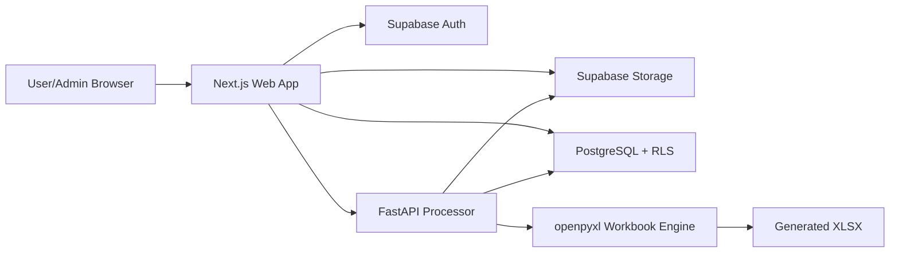
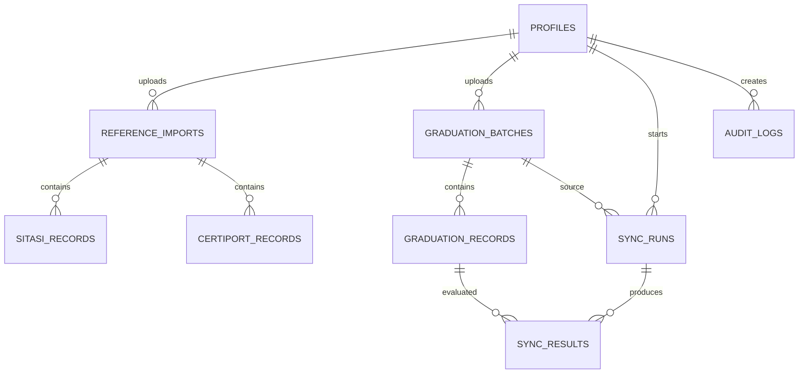

# Technical Specification: ITCC Wisuda Sync

## 1. Architecture



Next.js menangani UI dan session-aware API client. Supabase menyimpan identity, metadata batch, hasil sinkronisasi, audit, dan file dengan policy. FastAPI menjalankan pekerjaan yang membutuhkan pembacaan dan penulisan workbook. Proses matching harus deterministik dan tidak menggunakan LLM.

## 2. Tech stack

| Komponen | Pilihan | Alasan |
|---|---|---|
| Frontend | Next.js App Router + TypeScript | Sesuai stack, routing dan typed UI baik untuk workflow bertahap |
| Styling | Tailwind CSS + CSS variables | Token neumorphism dapat dikelola terpusat |
| Auth | Supabase Auth | Email/password dan session siap pakai |
| Database | Supabase PostgreSQL | Relasional, cocok untuk histori per NIM, batch, hasil, dan audit |
| Storage | Supabase Storage | File source/output terpisah dari database |
| Processor | Python FastAPI | Pemrosesan file dan service worker terisolasi |
| Excel | openpyxl | Membaca dan menyimpan workbook, sheet, formula, dan style |
| Testing | Vitest/Playwright dan pytest | Unit, API, workbook, dan browser workflow |
| Deployment | Vercel + service Python terpisah | Frontend edge-friendly, processor tidak dibatasi durasi request frontend |

## 3. Data model



## 4. Database schema

### `profiles`

`id uuid PK`, `email text`, `display_name text`, `role text CHECK (role IN ('USER','ADMIN'))`, `is_active boolean`, timestamps.

### `reference_imports`

`id uuid PK`, `source_type text CHECK (source_type IN ('SITASI','CERTIPORT'))`, `file_name text`, `storage_path text UNIQUE`, `period text`, `record_count integer`, `validation_status text`, `is_active boolean`, `uploaded_by uuid FK profiles`, `uploaded_at timestamptz`, `archived_at timestamptz`.

### `sitasi_records`

`id uuid PK`, `reference_import_id uuid FK`, `nim text`, `nama text`, `fakultas text`, `kode_nim text`, `program_studi text`, `angkatan text`, `sertifikasi text`, `sub_program text`, `periode_kegiatan text`, `tahun text`, `kelompok_ujian text`, `nilai numeric`, `status text`, `raw_row jsonb`.

Index: `(reference_import_id, nim)`, `(nim, status)`.

### `certiport_records`

`id uuid PK`, `reference_import_id uuid FK`, `first_name text`, `last_name text`, `full_name_normalized text`, `student_employee_id text`, `username text`, `exam text`, `program_name text`, `certification_name text`, `exam_date date`, `score numeric`, `result text`, `raw_row jsonb`.

Index: `(reference_import_id, student_employee_id)`, `(reference_import_id, full_name_normalized)`.

### `graduation_batches`

`id uuid PK`, `file_name text`, `storage_path text UNIQUE`, `uploaded_by uuid FK`, `validation_status text`, `sheet_count integer`, `total_rows integer`, `uploaded_at timestamptz`.

### `graduation_records`

`id uuid PK`, `graduation_batch_id uuid FK`, `sheet_name text`, `source_row integer`, `nim text`, `nama text`, `program_code text`, `program_studi text`, `raw_row jsonb`.

Unique constraint: `(graduation_batch_id, sheet_name, source_row)`.

### `sync_runs`

`id uuid PK`, `graduation_batch_id uuid FK`, `sitasi_import_id uuid FK`, `certiport_import_id uuid FK`, `started_by uuid FK`, `status text`, `current_stage text`, `progress numeric`, `total_records integer`, `processed_records integer`, `ready_count integer`, `review_count integer`, `failed_count integer`, `output_file_path text`, timestamps.

### `sync_results`

`id uuid PK`, `sync_run_id uuid FK`, `graduation_record_id uuid FK`, `sitasi_match_status text`, `certiport_match_status text`, `mos_status text`, `mos_value text`, `mcf_status text`, `title_value text`, `result_status text`, `reason text`, `review_decision text`, `reviewed_by uuid FK`, `reviewed_at timestamptz`.

### `audit_logs`

`id uuid PK`, `actor_id uuid FK`, `action text`, `entity_type text`, `entity_id uuid`, `metadata jsonb`, `created_at timestamptz`.

## 5. API contract

Base path: `/api`. JSON uses camelCase. All authenticated endpoints require a valid Supabase access token.

### Common error

```json
{
  "error": {
    "code": "VALIDATION_ERROR",
    "message": "Kolom NIM tidak ditemukan pada sheet S1 31.",
    "fields": [{"field": "sheetName", "message": "Kolom NIM wajib ada."}],
    "requestId": "uuid"
  }
}
```

### `GET /api/me`

Response:

```json
{"id":"uuid","email":"operator@example.test","displayName":"Operator","role":"USER"}
```

### `POST /api/admin/reference-imports/sitasi`

Multipart field `file`, text field `period`.

Response `202`:

```json
{"importId":"uuid","sourceType":"SITASI","status":"VALIDATING"}
```

### `POST /api/admin/reference-imports/certiport`

Multipart field `file`, text field `period`.

Response `202` memiliki shape yang sama dengan SITASI, dengan `sourceType = CERTIPORT`.

### `GET /api/admin/reference-imports?sourceType=SITASI&status=ACTIVE`

Response:

```json
{"items":[{"id":"uuid","sourceType":"SITASI","fileName":"sitasi.xlsx","period":"Wisuda 2026","recordCount":7449,"validationStatus":"VALID","isActive":true}],"nextCursor":null}
```

### `POST /api/admin/reference-imports/{id}/activate`

Response:

```json
{"id":"uuid","isActive":true}
```

### `POST /api/graduation-batches`

Multipart field `file`.

Response `202`:

```json
{"batchId":"uuid","status":"VALIDATING","sheetCount":14}
```

### `GET /api/graduation-batches/{id}/validation`

Response:

```json
{"batchId":"uuid","status":"VALID","sheets":[{"name":"S1 31","status":"VALID","rowCount":425,"columns":["NIM","Nama"]}],"errors":[]}
```

### `GET /api/reference-batches/active`

Response:

```json
{"sitasi":{"id":"uuid","period":"Wisuda 2026"},"certiport":{"id":"uuid","period":"2026"}}
```

### `POST /api/sync-runs`

Request:

```json
{"graduationBatchId":"uuid","sitasiImportId":"uuid","certiportImportId":"uuid"}
```

Response `202`:

```json
{"syncRunId":"uuid","status":"QUEUED"}
```

### `GET /api/sync-runs/{id}`

Response:

```json
{"id":"uuid","status":"PROCESSING","currentStage":"MATCHING_CERTIPORT","progress":62,"totalRecords":500,"processedRecords":310,"readyCount":250,"reviewCount":40,"failedCount":20}
```

### `GET /api/sync-runs/{id}/results`

Query: `status`, `search`, `page`, `pageSize`.

Response:

```json
{"items":[{"id":"uuid","sheetName":"S1 31","sourceRow":12,"nim":"202431001","nama":"NAMA CONTOH","programStudi":"S1 Teknik Informatika","mosValue":"MOS (Word 2019 - Lulus)","mcfStatus":"PASSED","titleValue":"MOS & MCF","resultStatus":"READY","reason":null}],"page":1,"pageSize":25,"total":1}
```

### `POST /api/sync-results/{id}/review`

Request:

```json
{"decision":"CONFIRMED","note":"ID Certiport dikonfirmasi oleh operator."}
```

Response:

```json
{"resultId":"uuid","reviewDecision":"CONFIRMED","resultStatus":"READY","reviewedBy":"uuid"}
```

### `POST /api/sync-runs/{id}/generate-output`

Response `202`:

```json
{"syncRunId":"uuid","status":"GENERATING_OUTPUT"}
```

### `GET /api/files/{id}/download`

Returns a short-lived authorized download URL or streams the file. It must not expose unrestricted storage paths.

## 6. Processing algorithm

1. Parse workbook and persist graduation row metadata.
2. Normalize NIM as text.
3. Group SITASI rows by NIM and check any `LULUS` status.
4. Match Certiport by `Student / Employee ID = NIM`.
5. For records without valid ID match, produce name candidates with `REVIEW_REQUIRED`.
6. Filter Certiport to `Result = Pass`.
7. Select the latest passed MOS credential.
8. Select MCF only when `Program Name = Microsoft Certified Fundamentals` and program code is 31 or 32.
9. Compute the two output values.
10. Require review decisions where needed.
11. Copy the original workbook to a new output and modify only the two ITCC columns.
12. Validate workbook preservation before marking output ready.

## 7. Third-party services

- Supabase Auth, PostgreSQL, and Storage.
- Vercel for frontend hosting.
- A Python hosting service for FastAPI processor.
- No external AI service is required for the deterministic MVP.

